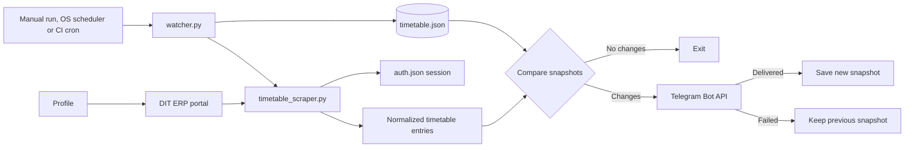
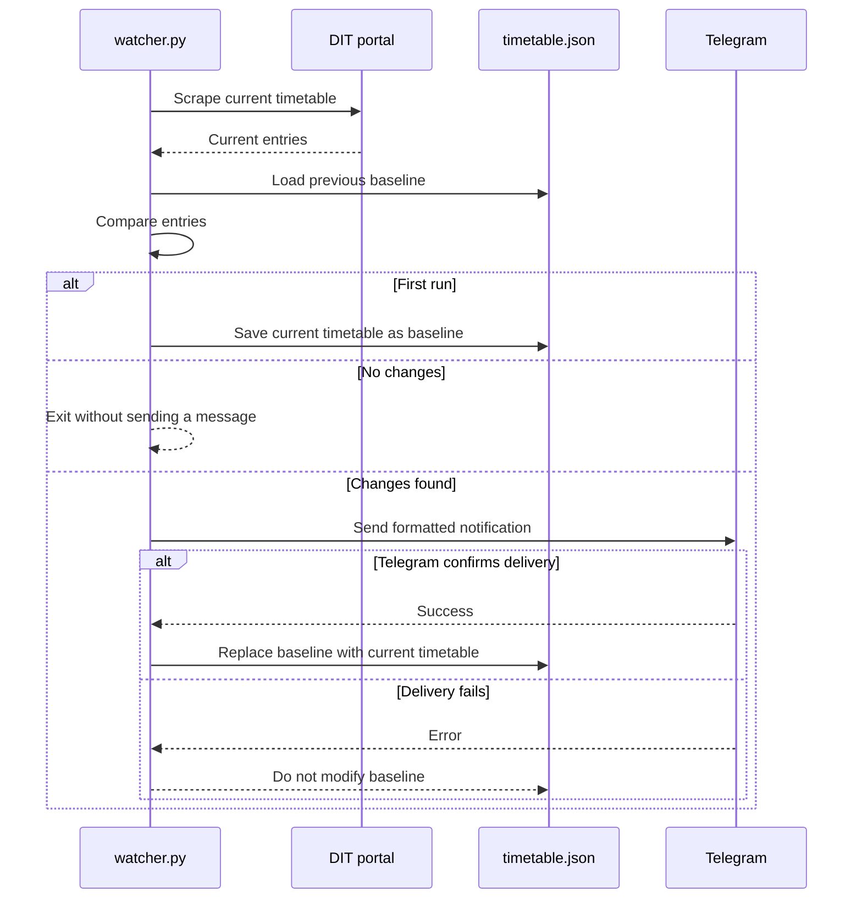
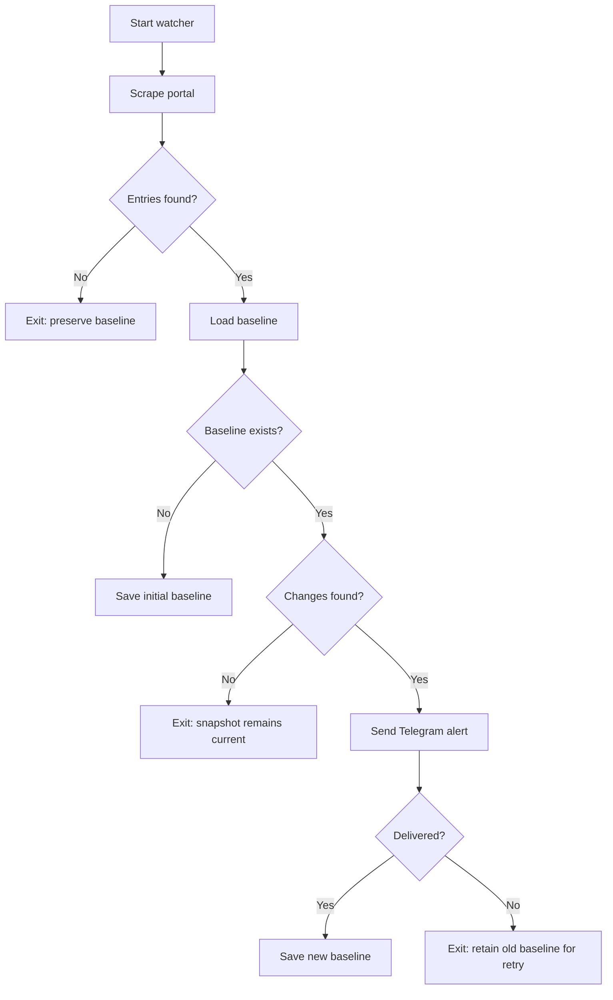

# College Schedule Watcher

College Schedule Watcher monitors the DIT timetable portal, compares the live timetable with a local baseline, and sends a Telegram alert only when a meaningful change is detected.

It supports both local scheduled use and unattended CI use (e.g. GitHub Actions). Authentication is kept in a single `auth.json` session file (Playwright's `storage state`), so no portal credentials are stored in this repository.

## Features

- Scrapes the DIT timetable through the authenticated portal session.
- Detects added, removed, and modified classes.
- Reports changes to subject, time, room, primary faculty, and secondary faculty.
- Delivers readable, split-safe Telegram messages (up to 4,000 characters per message part).
- Preserves the previous snapshot when Telegram delivery fails, allowing the next run to retry the same alert.
- Uses a first run only to establish a baseline; it does not send an alert for every existing class.

## Architecture



### Delivery guarantee workflow



## Repository layout

```text
.
├── .env.example                    # Safe template for local Telegram configuration
├── .gitignore                      # Excludes secrets, local snapshots
├── .github/workflows/watcher.yml   # Optional: scheduled CI run (see "Running in CI")
├── LICENSE                         # MIT License
├── fetch_state.py                  # CI helper: restores timetable.json from a private Gist
├── login_session.py                # Visible-browser helper to establish/refresh portal login
├── push_state.py                   # CI helper: saves timetable.json back to the private Gist
├── requirements.txt                # Python dependencies
├── timetable_scraper.py            # Playwright portal navigation and row extraction
└── watcher.py                      # Comparison, notification, and snapshot workflow
```

Generated local files are deliberately excluded from Git:

- `.env` — Telegram credentials
- `auth.json` — authenticated portal session (Playwright storage_state)
- `timetable.json` — machine-specific runtime baseline
- `__pycache__/` and editor settings


## Requirements
 
- Python 3.11
- A DIT account that can access the timetable portal
- Telegram account and bot
- Chromium installed by Playwright

## Setup

### 1. Clone and create an environment

```powershell
git clone https://github.com/vush-man/DIT-Schedule-Watcher.git
Set-Location "DIT Schedule Watcher"
python -m venv .venv
.\.venv\Scripts\Activate.ps1
```

On macOS or Linux, activate with `source .venv/bin/activate`.

### 2. Install the dependencies and browser

```powershell
python -m pip install --upgrade pip
python -m pip install -r requirements.txt
python -m playwright install chromium
```

### 3. Configure Telegram

Copy the template without committing the resulting file:

```powershell
Copy-Item .env.example .env
```

Set the following values in `.env`:

```env
TELEGRAM_BOT_TOKEN=123456789:replace-with-a-real-token
TELEGRAM_CHAT_ID=123456789
```

`TELEGRAM_CHAT_ID` must be either:

- a numeric personal or group chat ID (for example `123456789` or
  `-1001234567890`); or
- a public channel username such as `@department_updates`.

It must **not** be a `t.me/...` link. The watcher validates this before it calls Telegram.

### 4. Create the bot and find the chat ID

1. In Telegram, open [@BotFather](https://t.me/BotFather) and send `/newbot`.
2. Save the token it returns in `.env`; treat it as a password.
3. Open a conversation with the new bot and send `/start`.
4. Open the following URL locally, replacing the placeholder with the token:

   ```text
   https://api.telegram.org/bot<YOUR_BOT_TOKEN>/getUpdates
   ```

5. Copy `result[0].message.chat.id` into `TELEGRAM_CHAT_ID`.

For a group, add the bot, send a message in that group, and use the group chat ID returned by the same endpoint. For a channel, add the bot as an administrator and use its public `@channel_username` or numeric channel ID.

> If a token has appeared in a terminal log, chat, screenshot, or commit,
> revoke it in BotFather and create a replacement before continuing.

### 5. Establish the DIT portal session
 
Run the visible-browser helper:
 
```powershell
python login_session.py
```
 
Complete the Microsoft/DIT sign-in flow in the browser window, including MFA if prompted. Once you can see the portal dashboard, press Enter in the terminal. This saves the session to `auth.json` in the project root. Do not share or commit this file — it grants access to the portal without a password.

## Running the watcher

Use `watcher.py` for normal operation:

```powershell
python watcher.py
```

Do not use `timetable_scraper.py` directly for scheduled monitoring: its standalone mode writes `timetable.json` directly and bypasses notification and delivery protection.

### First run

The first successful run creates `timetable.json` and exits without a Telegram message. This becomes the comparison baseline.

### Later runs

Each later run performs this workflow:



## Change detection

The watcher identifies a class using this stable key:

```text
batch + course_code + class_type + day
```

For each matching class, it compares `subject`, `time`, `room`, `faculty`, and
`secondary_faculty`. The notification separates results into:

- **Added** — a new class key appears.
- **Removed** — a class key disappears.
- **Modified** — a tracked field changed for an existing class key.

The scraper stores each timetable row with batch, course, subject, course type, credits, class type, day, time, room, faculty, secondary faculty, and department.

## Scheduling

### Locally

Run the watcher at an interval appropriate for timetable updates, for example every hour during the semester. Use the full paths to the Python interpreter and project when configuring an operating-system scheduler.

Example command for Windows Task Scheduler:

```text
C:\path\to\College Schedule Watcher\.venv\Scripts\python.exe C:\path\to\College Schedule Watcher\watcher.py
```

The task must run under the same user account/machine where `auth.json` was generated, or have that file present alongside the script.

### Running in CI (GitHub Actions)
 
For fully unattended monitoring without keeping a local machine on, run the watcher on a schedule via GitHub Actions.
 
Since this repository is intended to be public, the timetable baseline (`timetable.json`) is kept out of the repo entirely and synced instead with a **private GitHub Gist** — so your class schedule, room numbers, and faculty names aren't published on every run the way a committed-to-repo baseline would be.
 
1. Generate `auth.json` locally as in Setup step 5.
2. Store it as a repo secret (small enough to fit the 64KB secret limit as a
   single session file, unlike a full browser profile):
```powershell
gh secret set AUTH_JSON < auth.json
```
3. Create a **private** Gist (gist.github.com, "Create secret gist") with one file named `state.json` containing `[]`. Copy its id from the URL (`https://gist.github.com/<username>/<this-part>`).
4. Create a GitHub Personal Access Token (classic) with only the `gist` scope: [github.com/settings/tokens](https://github.com/settings/tokens)
5. Add these as repo secrets:
```powershell
gh secret set GIST_TOKEN     # paste the PAT from step 4
gh secret set GIST_ID        # paste the gist id from step 3
gh secret set TELEGRAM_BOT_TOKEN
gh secret set TELEGRAM_CHAT_ID
```
6. Commit `.github/workflows/watcher.yml`, `fetch_state.py`, and `push_state.py` (all included in this repo). Each scheduled run:
   - restores `auth.json` from the `AUTH_JSON` secret
   - restores the previous timetable baseline from the Gist via
     `fetch_state.py`
   - runs `watcher.py` as normal — it has no idea the baseline came from a Gist rather than a local file, since it's still just reading/writing `timetable.json`
   - pushes the (possibly updated) `timetable.json` back to the Gist via `push_state.py`
7. Adjust the `cron` schedule in the workflow to your class hours (values are in UTC).
8. Trigger the workflow manually once from the Actions tab to confirm it runs cleanly before relying on the schedule.

**Session expiry in CI:** Azure AD sessions eventually expire, and MFA cannot be completed unattended. When a scheduled run fails to reach the dashboard, re-run `login_session.py` locally, then update the `AUTH_JSON` secret with the fresh file. No redeploy is needed — the next scheduled run picks up the new secret automatically.
 
**Note on `storage_state` limitations:** `auth.json` captures cookies and localStorage, but not IndexedDB or Service Worker state. If the portal's Azure AD session relies on either of those, a freshly generated `auth.json` may not be sufficient on its own — test one CI run right after generating it to confirm before relying on the schedule.

## Troubleshooting
 
| Symptom | Likely cause | Resolution |
| --- | --- | --- |
| Portal requires login | Session expired | Run `python login_session.py`, sign in, then rerun the watcher (or update the `AUTH_JSON` secret for CI). |
| Browser executable missing | Playwright browser was not installed | Run `python -m playwright install chromium`. |
| `TELEGRAM_CHAT_ID` validation error | A bot link or invalid value was used | Set a numeric chat ID or `@public_channel`; never use `t.me/...`. |
| Telegram `400` | Bot cannot access the chat, token/chat ID is wrong, or payload is rejected | Start the bot, confirm the chat ID, and check the detailed error printed by the watcher. |
| No timetable entries | Portal layout, login, or iframe selector changed | Refresh login, inspect the page with `login_session.py`, then update scraper selectors if needed. |
| Notification failed and repeats | Expected delivery protection | Fix Telegram configuration; the old snapshot is intentionally retained until one alert succeeds. |
| CI run reports "Login required" right after refreshing `AUTH_JSON` | `storage_state` didn't capture something the session needs (see IndexedDB note above) | Confirm locally that a fresh `auth.json` alone (no leftover browser profile) can reach the dashboard before trusting it in CI. |

## Git readiness
 
Before publishing — **especially before making the repo public** — check for anything sensitive left over from earlier setup attempts:
 
```powershell
git status --ignored
git check-ignore -v .env auth.json timetable.json
git log --all --full-history -- auth.json .env timetable.json college_browser college_browser_profile.zip profile_b64.txt
```
 
If that last command returns any commits, a sensitive file was committed at some point even if it was later removed — it's still recoverable from git history. Deleting the file isn't enough; you need to purge it from history (e.g. `git filter-repo`) **and** treat whatever leaked as compromised: regenerate `auth.json` via `login_session.py`, and rotate the Telegram bot token via BotFather. A leaked `auth.json` is a live, passwordless session into your college account — not just an API key — so don't skip this if history shows it was ever committed.
 
If any sensitive/generated file was previously committed, remove it from Git's index while keeping the local copy:
 
```powershell
git rm --cached --ignore-unmatch .env auth.json
```
 
Then initialise and publish as appropriate:
 
```powershell
git init
git add .env.example .gitignore LICENSE README.md requirements.txt watcher.py timetable_scraper.py login_session.py fetch_state.py push_state.py .github/workflows/watcher.yml
git commit -m "Initial commit: College Schedule Watcher"
```
 
Use a private repository unless you have reviewed all files and history — the project is MIT licensed (see below), so it's ready for a public release once you've confirmed no secrets or session files are in the history.
 
## License
 
MIT — see [LICENSE](LICENSE). You're free to use, modify, and distribute this project, including commercially, as long as the copyright notice is retained.
The software is provided as-is, with no warranty.
 
## Security notes
 
- Never commit `.env` or `auth.json`.
- Treat `auth.json` as an authenticated credential — anyone with it can access the portal as you without a password.
- Treat the `GIST_TOKEN` the same way — it can read/write your private Gist, which (in CI) holds your class schedule data.
- Rotate Telegram tokens immediately after exposure.
- Do not paste bot tokens, `auth.json` contents, the `AUTH_JSON`/`GIST_TOKEN` secret values, or the Gist URL into issue trackers, pull requests, terminal output, screenshots, or support conversations.
